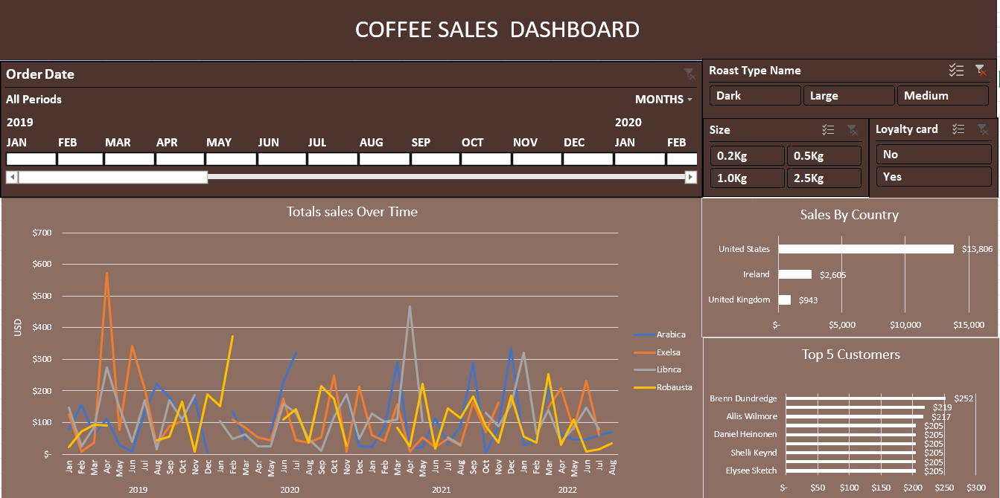

# ☕ Coffee Sales Interactive Dashboard

## 📌 Project Overview
A comprehensive Excel-based data analysis project that transforms raw coffee order data into an interactive visual dashboard. This project demonstrates advanced Excel skills, including data cleaning, complex formulas, and professional dashboard design.

## 📸 Dashboard Preview
 
*(Make sure to upload your screenshot with the name dashboard.png)*

## 🛠️ Key Features & Skills Applied
- **Data Modeling:** Linked multiple tables (Orders, Customers, and Products) using advanced lookup functions like `XLOOKUP` and `INDEX/MATCH`.
- **Data Cleaning:** Processed raw data to handle date formatting, currency consistency, and duplicate removal.
- **Pivot Tables & Charts:** Summarized thousands of rows of data to visualize:
    - Total Sales over time (Time-Series Analysis).
    - Sales distribution by Country (USA, UK, Ireland).
    - Top 5 Customers by revenue.
    - Sales by Coffee Type (Arabica, Excelsa, Robusta, Liberica).
- **Interactivity:** Integrated dynamic **Slicers** to allow users to filter data by roast type, size, and loyalty card status.

## 🧰 Tools Used
- **Microsoft Excel** (Pivot Tables, Power Pivot, Advanced Formulas)
- **Data Visualization** (Clustered Bar Charts, Line Charts, Slicers)

## 📊 Key Insights
- Identified the most profitable coffee types across different regions.
- Visualized sales trends to determine peak ordering months.
- Analyzed customer loyalty patterns to understand their impact on total revenue.
